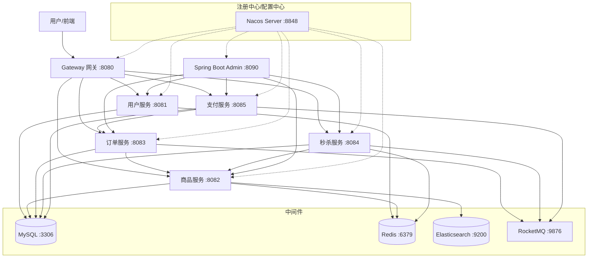

# 微服务架构电商平台

> 从 0 到 1 搭建的微服务电商平台，包含用户、商品、订单、秒杀、支付五大核心服务。  
> 简历项目，技术栈覆盖 Spring Cloud Alibaba 全栈生态。

---

## 目录

- [架构图](#架构图)
- [技术栈](#技术栈)
- [模块说明](#模块说明)
- [快速启动](#快速启动)
- [接口概览](#接口概览)
- [项目亮点](#项目亮点)
- [压测数据](#压测数据)

---

## 架构图



---

## 技术栈

| 层级 | 技术 | 版本 |
|------|------|------|
| 框架 | Spring Boot | 3.2.5 |
| JDK | Oracle JDK | 17+ |
| 微服务 | Spring Cloud Alibaba | 2023.0.1 |
| 注册/配置中心 | Nacos | 2.3.0 |
| 网关 | Spring Cloud Gateway | — |
| ORM | MyBatis-Plus | 3.5.5 |
| 数据库 | MySQL | 8.0 |
| 缓存 | Redis | 7.0 |
| 搜索 | Elasticsearch | 7.17 |
| 消息队列 | RocketMQ | 5.1.4 |
| 分布式锁 | Redisson | 3.29 |
| 服务容错 | Sentinel | — |
| 监控 | Spring Boot Admin | 3.2.3 |
| 工具集 | Hutool | 5.8 |
| JWT | JJWT | 0.12 |

---

## 模块说明

| 模块 | 端口 | 说明 |
|------|------|------|
| `gateway` | 8080 | 统一网关，路由转发、跨域、鉴权 |
| `common` | — | 公共模块：响应体、异常、JWT 工具、配置 |
| `ecommerce-admin` | 8090 | Spring Boot Admin 监控面板 |
| `service-user` | 8081 | 用户服务：注册/登录/JWT/RBAC 权限 |
| `service-product` | 8082 | 商品服务：CRUD/ES搜索/Redis缓存 |
| `service-order` | 8083 | 订单服务：状态机/Feign/延迟取消 |
| `service-seckill` | 8084 | 秒杀服务：Redis+Lua/MQ削峰/限流 |
| `service-payment` | 8085 | 支付服务：沙箱对接/回调幂等 |

---

## 快速启动

### 前置条件

- JDK 17+
- Maven 3.9+
- Docker Desktop（用于运行中间件）
- Navicat（管理 MySQL，可选）

### 1. 启动中间件

```bash
# 启动所有中间件（第一次会拉取镜像，较慢）
docker compose -f ecommerce-platform/docker-compose.yml up -d

# 确认全部 running
docker compose ps
```

### 2. 初始化数据库

用 Navicat 连接 `localhost:3306`（root / 123456），运行：

```
文件 → 运行SQL文件 → 选择 docs/init.sql → 执行
```

### 3. 启动服务

按顺序启动（Nacos 就绪后）：

```bash
# 编译全部模块
mvn -f ecommerce-platform/pom.xml clean package -DskipTests

# 启动各个服务（每个开一个终端，或使用 IDE 启动类）
java -jar ecommerce-platform/ecommerce-admin/target/ecommerce-admin-1.0.0.jar
java -jar ecommerce-platform/gateway/target/gateway-1.0.0.jar
java -jar ecommerce-platform/service-user/target/service-user-1.0.0.jar
java -jar ecommerce-platform/service-product/target/service-product-1.0.0.jar
java -jar ecommerce-platform/service-order/target/service-order-1.0.0.jar
java -jar ecommerce-platform/service-seckill/target/service-seckill-1.0.0.jar
java -jar ecommerce-platform/service-payment/target/service-payment-1.0.0.jar
```

### 4. 验证

| 地址 | 说明 |
|------|------|
| `http://localhost:8080` | 网关 |
| `http://localhost:8848/nacos` | Nacos 控制台（服务注册列表） |
| `http://localhost:8090` | Admin 监控面板（admin/admin123） |
| `http://localhost:8088` | RocketMQ Dashboard |
| `http://localhost:5601` | Kibana |

---

## 接口概览

所有请求通过 Gateway（`:8080`）转发，Prefix 统一为 `/api`。

### 用户服务

| 方法 | 路径 | 说明 | 需登录 |
|------|------|------|--------|
| POST | `/api/user/register` | 注册 | ❌ |
| POST | `/api/user/login` | 登录 | ❌ |
| POST | `/api/user/refresh` | 刷新 Token | ❌ |
| POST | `/api/user/logout` | 登出 | ✅ |
| GET | `/api/user/info` | 当前用户信息 | ✅ |

### 商品服务

| 方法 | 路径 | 说明 | 需登录 |
|------|------|------|--------|
| GET | `/api/product/spu/page` | 商品分页 | ❌ |
| GET | `/api/product/spu/{id}` | 商品详情 | ❌ |
| POST | `/api/product/search` | ES 搜索商品 | ❌ |
| POST | `/api/product/spu` | 创建商品 | ✅ |
| PUT | `/api/product/spu` | 更新商品 | ✅ |
| PUT | `/api/product/spu/{id}/status` | 上下架 | ✅ |

### 订单服务

| 方法 | 路径 | 说明 | 需登录 |
|------|------|------|--------|
| POST | `/api/order` | 创建订单 | ✅ |
| GET | `/api/order/{id}` | 订单详情 | ✅ |
| GET | `/api/order/page` | 我的订单列表 | ✅ |
| POST | `/api/order/{id}/cancel` | 取消订单 | ✅ |

### 秒杀服务

| 方法 | 路径 | 说明 | 需登录 |
|------|------|------|--------|
| POST | `/api/seckill` | 秒杀下单 | ✅ |
| GET | `/api/seckill/activities` | 秒杀活动列表 | ❌ |
| GET | `/api/seckill/stock/{activityId}/{skuId}` | 实时库存 | ❌ |
| POST | `/api/seckill/warm-up/{activityId}` | 预热库存 | ✅ |

### 支付服务

| 方法 | 路径 | 说明 | 需登录 |
|------|------|------|--------|
| POST | `/api/payment` | 创建支付 | ✅ |
| POST | `/api/payment/notify` | 支付回调 | ❌（支付宝回调） |

---

## 项目亮点

### 秒杀系统（核心亮点）

```
请求 → Gateway(Sentinel限流) → 验证活动 → Lua原子扣库存
     → Redisson防重复 → MQ异步削峰 → 异步创建订单
```

- **Redis + Lua 脚本** 实现库存扣减原子性，消除超卖
- **RocketMQ 异步削峰** 将瞬时高并发流量打散为平滑消费
- **Redisson 分布式锁** 防止同一用户重复下单
- **Sentinel 双层限流**（网关层 + 服务层）保障核心链路稳定性

### Redis 缓存三防

- **击穿**：Redisson 分布式锁 + 双重检测
- **穿透**：空值缓存（短 TTL 60s）
- **雪崩**：随机过期时间（基础 TTL + 0~300s 随机偏移）

### 订单状态机

基于 Map 驱动的状态机，严格校验状态转换合法性：

```
待支付 ──→ 已支付 ──→ 已发货 ──→ 已完成
  │
  └──→ 已取消（用户主动 / 30分钟超时自动）
```

---

## 压测数据

> 压测工具：Apache JMeter  
> ⚠️ 以下数据为模板占位，请在实际环境中运行压测后填入真实数据。

| 场景 | 并发数 | QPS | P99 RT | 错误率 |
|------|--------|-----|--------|--------|
| 商品详情（无缓存） | 500 | — | — | — |
| 商品详情（有缓存） | 500 | — | — | — |
| 秒杀下单（无 MQ 削峰） | 1000 | — | — | — |
| 秒杀下单（MQ 削峰） | 5000 | — | — | — |
| 全链路混合压测 | 2000 | — | — | — |

---

## 项目结构

```
ecommerce-platform/
├── docker-compose.yml           # 中间件编排
├── pom.xml                      # Maven 父工程
├── docs/
│   ├── init.sql                 # 全量建库建表脚本
│   └── benchmark.md             # 压测方案
├── common/                      # 公共模块
├── gateway/                     # 网关
├── ecommerce-admin/             # Spring Boot Admin 监控
├── service-user/                # 用户服务
├── service-product/             # 商品服务
├── service-order/               # 订单服务
├── service-seckill/             # 秒杀服务
└── service-payment/             # 支付服务
```
